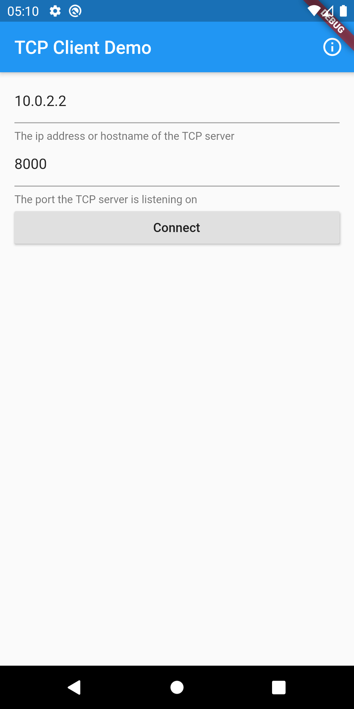
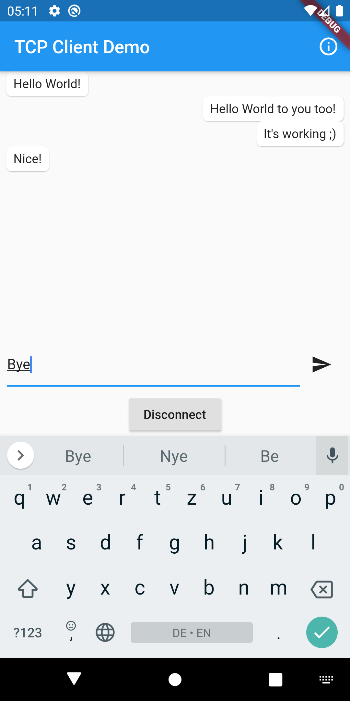

# Flutter TCP Demo
This app demonstrantes how to use TCP sockets in a flutter app.

The `app` folder contains the actual flutter app. This app allows the user to create a TCP connection to a TCP server identified by a hostname and a port the user can enter. A chat-like UI allows to receive messages from and send messages to the server.

The `server` folder contains a very simple TCP server that accepts incoming connections. It shows incoming messages from the client and sends messages written in the terminal to the client.




## Requirements
You need to have the following tools installed:
- [Flutter](https://flutter.dev/docs/get-started/install)
- [Node](https://nodejs.org/en/)

## Run

To start the server, go into the `server` folder and run

```bash
node index.js
```

To start the app, go into the `app` folder and run
```bash
flutter run
```

## Configuration
In the server file (`server/index.js`) you can configure the hostname and port of the TCP server by setting the `const` values `hostname` and `port`. The client side/app is configured during the runtime of the app. 

If you run the app in the Android Emulator, set the `hostname` in `index.js` to `localhost` and input the IP address `10.0.2.2` (the hosts IP address from inside the Android Emulator) in the app.

If you run the app on a real device, set the `hostname` in `index.js` and in the client app to the IP address of the machine in the local network (obtained via `ifconfig` (Linux) `ipconfig` (Windows)).

The ports specified in the server and the app must be the same.

## Flutter app architecture
*(Note: This is a quick and dirty example app)*

This app uses the [BLoC pattern](https://bloclibrary.dev/#/) to manage the state. There are two BLoC's. One is for managing the state of the TCP connection/socket and handling the incoming and outgoing messages. The other is for validating the user input for the connection details ()


## Tools used
- [Flutter](https://flutter.dev/)
- [Node](https://nodejs.org/en/)
- [BLoC](https://bloclibrary.dev/#/)
- [flutter_bloc](https://github.com/felangel/bloc/tree/master/packages/flutter_bloc)
- [bubble](https://github.com/vi-k/bubble)

Pull requests are always welcome